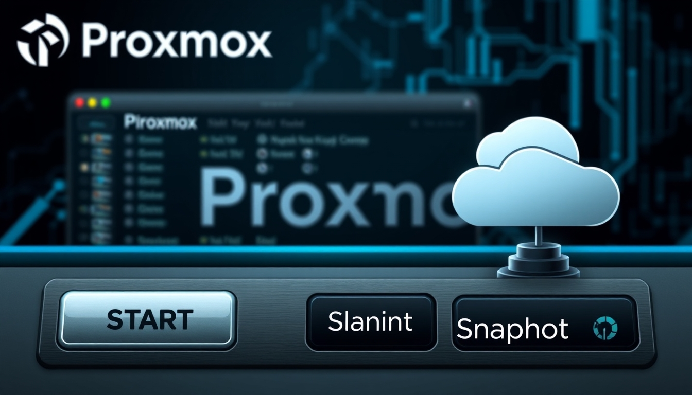

# Proxmox-validación
Control arranque de maquinas y snapshots 

Este script realiza los siguientes pasos:

1. Conecta a Proxmox usando la IP, usuario y contraseña proporcionados.
2. Inicia las máquinas virtuales 
3. Crea un snapshot de cada máquina virtual usando el parámetro snapname.
4. Consulta y muestra el estado actual de ambas máquinas virtuales.

Se debe isntalar 2 paquetes 

1. pip install proxmoxer
2. pip install requests

